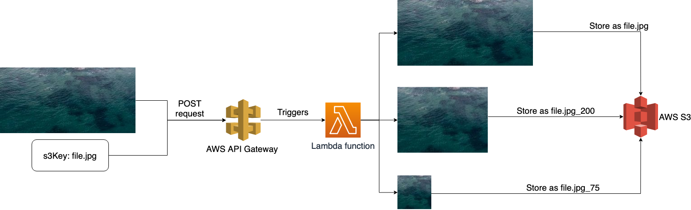

# Aircall assignment

This project aims to build and deploy Aircall's [SRE hiring test](https://github.com/aircall/sre-hiring-test) on AWS using Lambdas.

## Prerequisites

You will need the following tools for this to work on your machine: 
- Terraform (tested with v0.12.24)
- Docker (tested with Docker version 18.09.2, build 6247962)

You will also need to give Terraform some way of using the AWS APIs. You can refer to the [AWS provider page](https://www.terraform.io/docs/providers/aws/index.html) from Terraform's documentation for that.

I chose to create a user in my AWS account with API access and gave it the following permissions (by affecting it to a group that had those permissions): 
- AWSLambdaFullAccess
- IAMFullAccess
- AmazonS3FullAccess
- CloudWatchLogsFullAccess
- AmazonAPIGatewayAdministrator

This will allow us to deploy all the required resources on AWS. *FullAccess permissions probably aren't necessary, in the way that they probably contain more permissions than what is actually required. Further hardening would probably be useful for a production grade deployment.

## Project structure

The goal here is to deploy a function to AWS Lambda and trigger that Lambda's execution when sending a POST request to an API (that will be created using AWS APIGateway). This function will take an image it is sent, manipulate it and store it to an AWS S3 Bucket.



This project contains: 
- A Terraform file with a Terraform module containing the files required to create the required AWS resources (Lambda function and IAM role, S3 bucket and APIGateway REST API with IAM role and Lambda integration).
- The JS app's source code and [documentation](./src/README.md) in the `src` directory.
- A Makefile with instructions to automate various steps (such as building & packaging the app, deploying it or destroying & cleaning the infrastructure).
- A Dockerfile that is used to provide the user with a builder image called `resize-lambda-builder`. This image can then be used to either run tests for the JS project or package it in a zip file so that it can be deployed to Lambda.
- An `images` directory containing a set of images used to make sure everything was correctly deployed. (I do not own rights to these pictures. They were either taken from [Unsplash](https://unsplash.com/) or using Google Images and making sure the images' licenses allowed them to be reused).

## Usage

### Deploy the infrastructure

To get everything started, simply run the following command: 
```
make all
```

This will first build the afformentioned builder image, then run tests and package the app in a zip file before deploying all the infrastructure to AWS.  

Everything going well, you will then be given two output values: `api_url` and `bucket_url`.  

It is also possible to only deploy the infrastructure on AWS by running `terraform apply -auto-approve` or `make tf`.

### Deleting the infrastructure

To remove every resource deployed for this project from your AWS account, simply run the following: 
```
make destroy
```

### Sending requests to the API

To send requests, you will need the `api_url` returned by Terraform.
```
curl --location --request POST '<api_url>' --form 'file=@file.jpg' --form 's3Key=file.jpg'
```

### Accessing the images

The app will store the modified images to an S3 bucket. This project deploys an S3 bucket with a `public-read` ACL, that allows anyone to get the files stored on it. You will therefore need to make sure the bucket's name is unique for it to be correctly created.  

The image files can be accessed using the `bucket_url` provided by the Terraform output: 
```
curl <bucket_url>/file.jpg
```

For a given file (say `file.jpg`), the lambda function will store 3 files in the S3 bucket: 
- `file.jpg`
- `file.jpg_200`
- `file.jpg_75`

